# Image Processing Operations

This repository consists of images that were derived after applying image processing operations using the code part of my final project for my Image Processing Fundamentals Course.

Every operation with the subscript cv was implemented using OpenCV4. The rest were implemented using C and C++ algorithmically.

Due to plagarism concerns I was adviced by the professor to not upload the code but the results of each operation instead. 

## Image Processing Operations

Each operation was implemented on two region of interests (x, y, sx, sy):
	* (0, 0, 1200, 200)
	* (0, 200, 1200, 200)

1. add: Adds a user defined intensity to a grey-level image

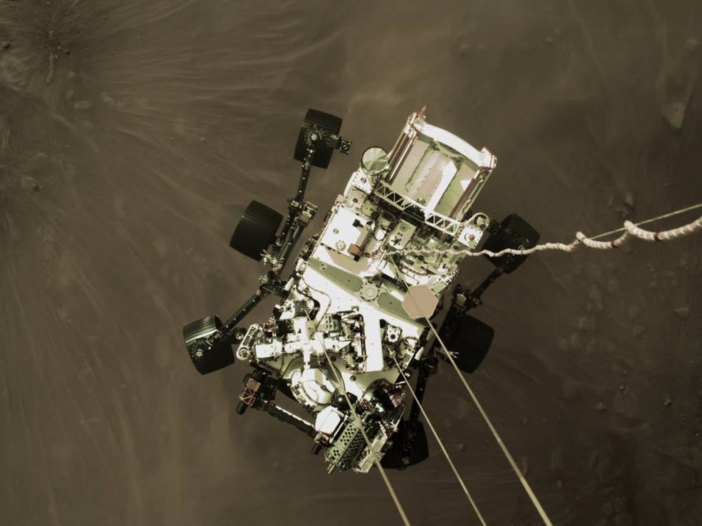 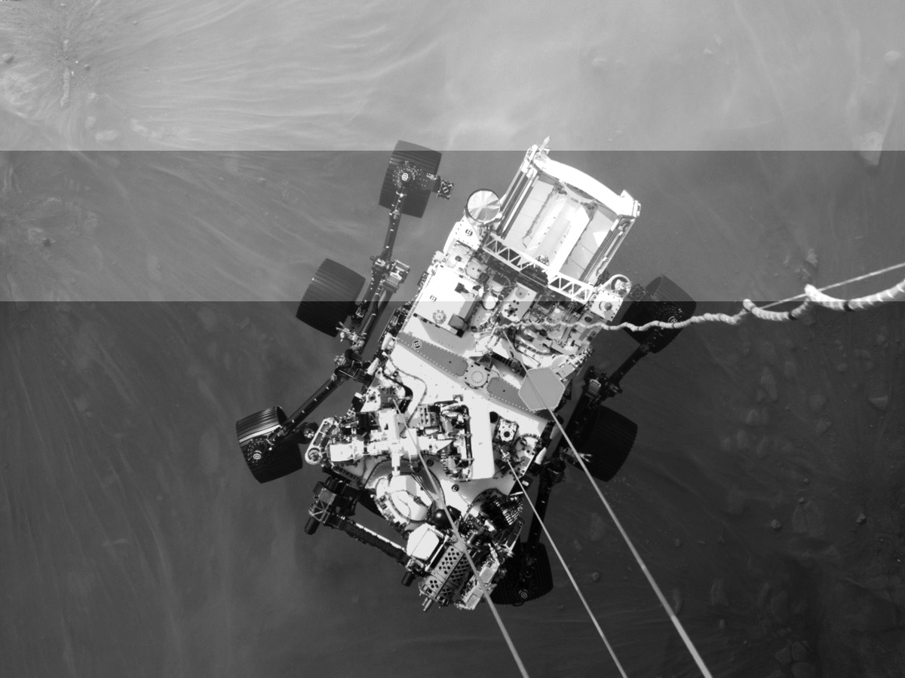

2. binarize: Perfromed on grey-level images. Based on a user defined threshold value, if the intensity of the pixel is less than the threshold, the intensity is set to 0, else it is set to 255.

 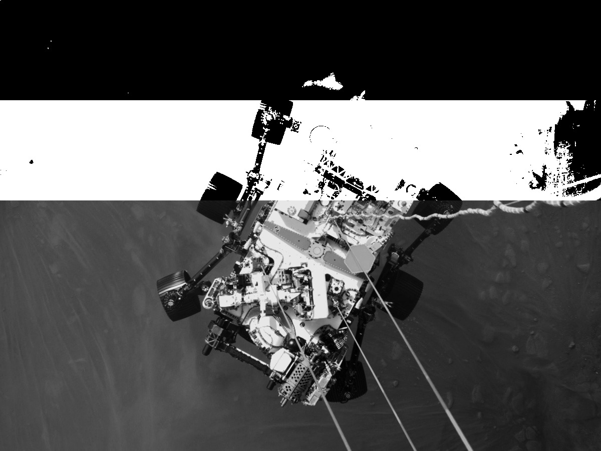

3. scale: Updates the size of the image to twice or half

 

4. threshold_add: Performed on grey-level images. Based on a user-defined threshold value, if the intensity of the pixel is more than the threshold, a user defined value v1 is added to the pixel. Else, v2 is subtracted.

 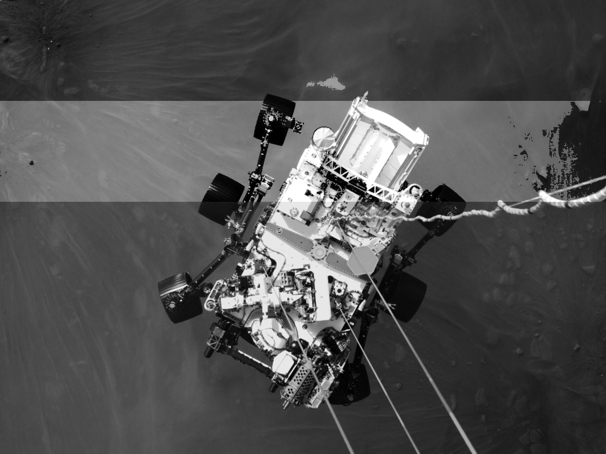

5. double_threshold: Performed on grey-level images. Based on user defined threshold values t1 and t2 (t1 < t2), if the intensity of the pixel is between t1 and t2, the intensity is set to 255. 

 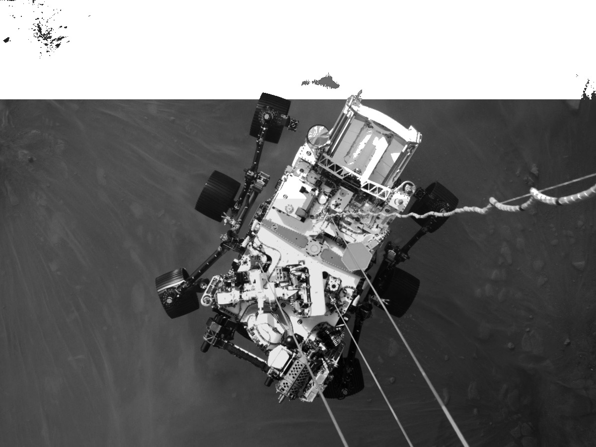

6. color_mod: Performed on color images. Based on user defined r,g,b values, the values are added to each channel in the color images.

 

7. 2d_smooth: Performed on grey-level images. Based on user defined window size, 2d smoothing with an averaging kernel is performed.

 

8. 1d_smooth: Performed on grey-level images. Based on user defined window size, 1d incremental smoothing with an averaging kernel is performed.

 

9. grey_level_stretching: Performed on grey-level images. Applies histogram stretching using user defined a and b values where a and b are the original minimum and maximum values to stretch from. 
The operation also outputs two histogram images: 
	* outputB: output is the output file name and B stands for before. 
	* outputA: A stands for after. 

 

 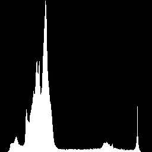

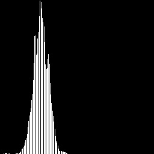  

10. threshold_stretching: Performed on grey-level images. Segments the image into foreground and background using a user defined threshold value and then applies histogram stretching on the segments individually.

 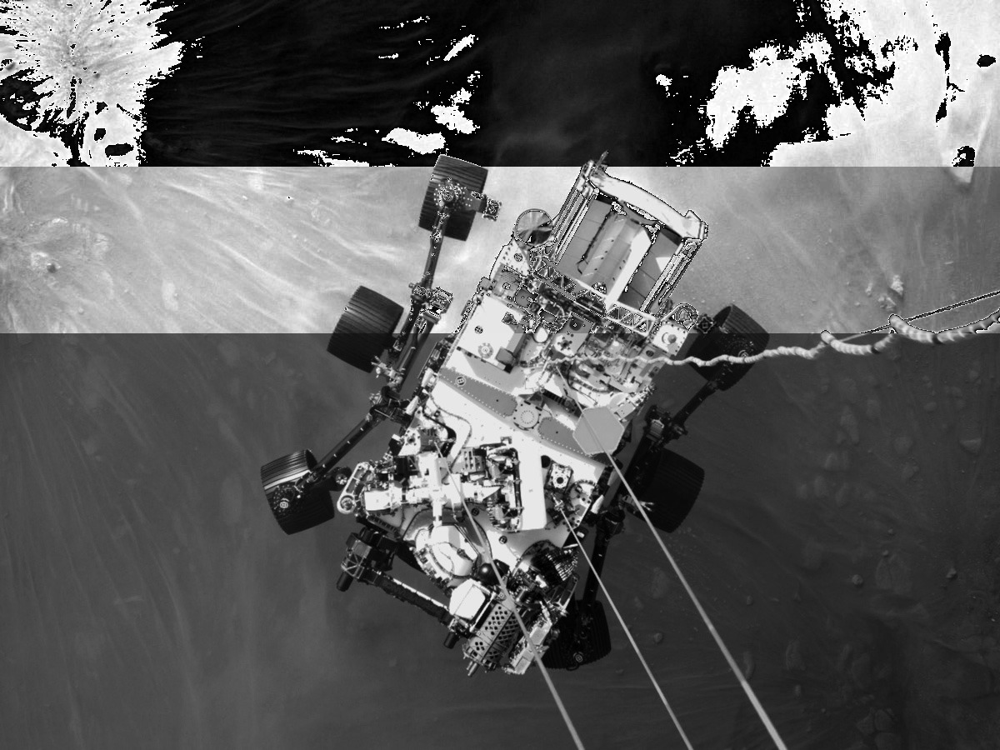

11. rgb_stretching: Performed on color images. Applies histogram stretching on all 3 (r,g,b) channels using user defined a and b values where a and b are the original minimum and maximum values to stretch from. 

 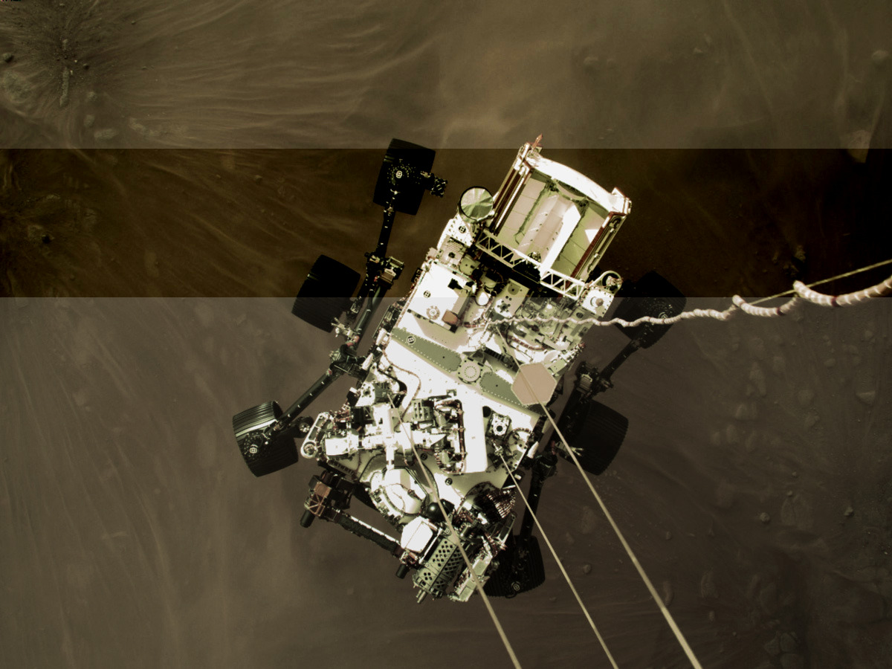

12. hsi_stretching: Performed on color images. Applies histogram stretching on the I channel in the HSI color space using user defined a and b values where a and b are the original minimum and maximum values to stretch from.

 

13. sobel_gradient: Performed on grey-level images. Applies the sobel operator on the image based on the window size of 3 or 5.

 

14. sobel_gradient_threshold: Performed on grey-level images. Applies the sobel operator on the image based on the window size of 3 or 5 followed by threshold based binarization.

 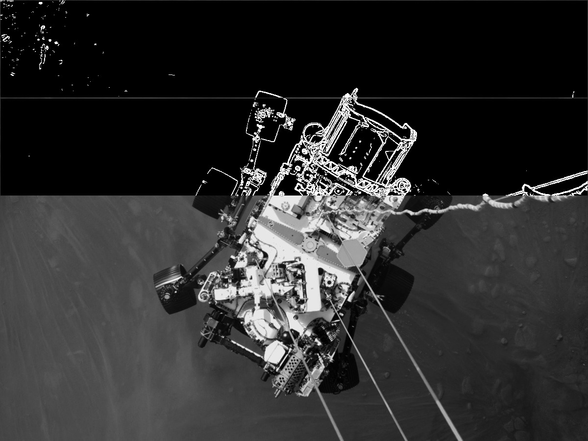

15. sobel_gradient_threshold_direction: Performed on grey-level images. Applies the sobel operator on the image based on the window size of 3 or 5 followed by threshold based binarization. The function then outputs the gradients that have the angles between the user defined range.

 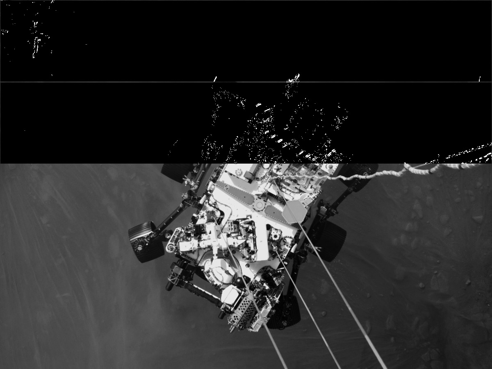

16. HSI_sobel: Performed on color images. Applies the sobel operator on the intensity channel of the HSI color space based on the window size of 3 or 5 followed by threshold based binarization and direction based thresholding. 
The function outputs 3 images:
	* output: The gradient image.
	* outputB: The thresholded image.
	* outputD: The direction thresholded image.

 

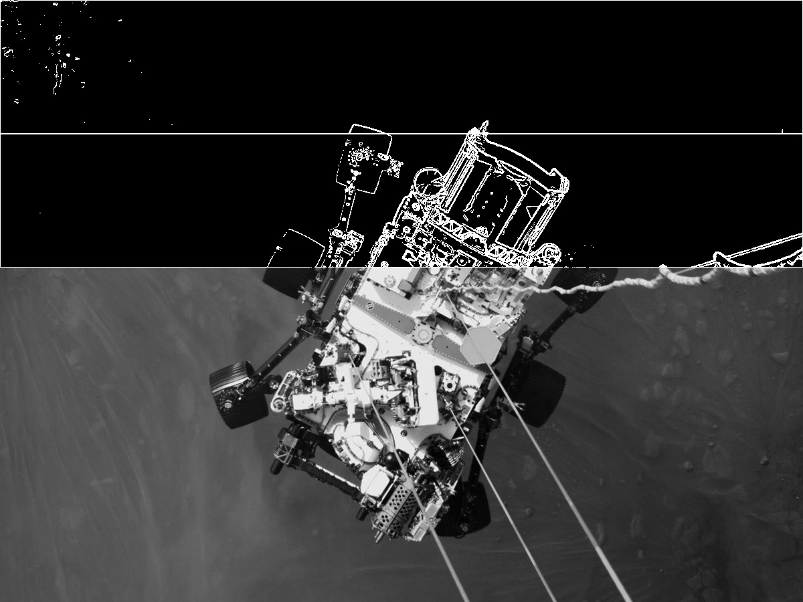 

17. cv_sobel: Performed on grey-level and color images. Converts the image to a grey-level image and applies the sobel operator. Outputs the binarized version of the gradient image based on the threshold value provided by the user.

  

18. cv_canny: Performed on grey-level and color images. Converts the image to a grey-level image and applies the canny operator using the user defined threshold values where threshold1 < threshold2.

 

19. cv_grey_hist_stretch: Performed on grey-level images. Applies histogram stretching on grey-level images.

 

20. cv_grey_hist_eq: Performed on grey-level images. Applies histogram equalization on grey-level images.

 

21. cv_HSV_hist_eq: Performed on color images. Applies histogram equalization on user defined channels in the HSV color space. 
Example channel input: HS (This will apply histogram equalization on the hue and saturation channels.)

 

22. cv_hist_eq_canny: Performed on grey-level and color images. Converts the image to a grey-level image, applies histogram equalization followed by the canny operator.

 

6. cv_hist_eq_sobel: Performed on grey-level and color images. Converts the image to a grey-level image, applies histogram equalization followed by the sobel operator.
The function outputs 2 images:
	* output: The gradient image.
	* outputB: The thresholded image.

  

7. scan_code: Performed on grey-level and color images. Utilizes the QRCodeDetector class in OpenCV to detect and decode QR codes.